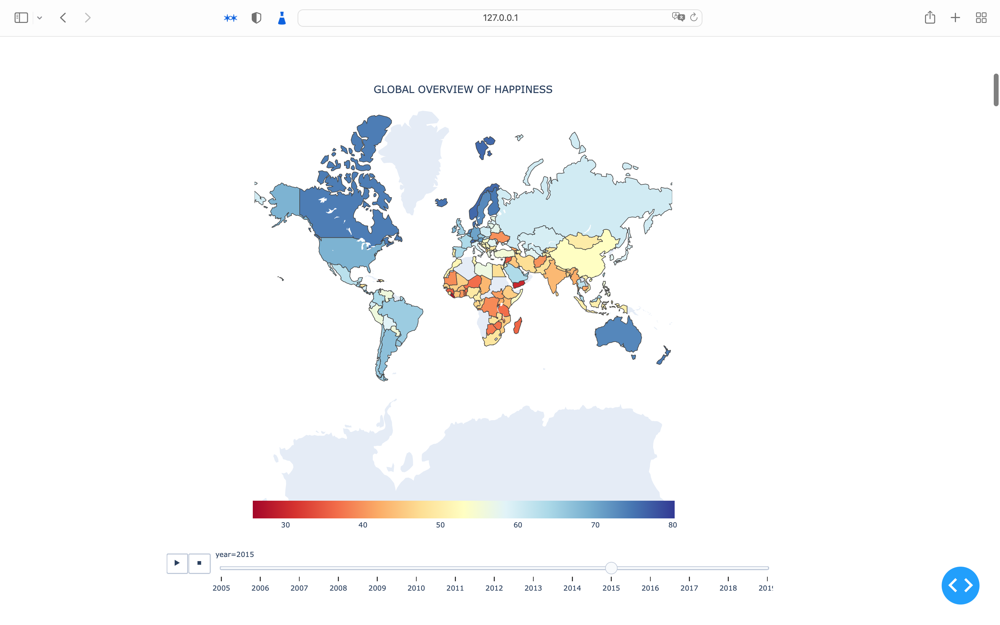
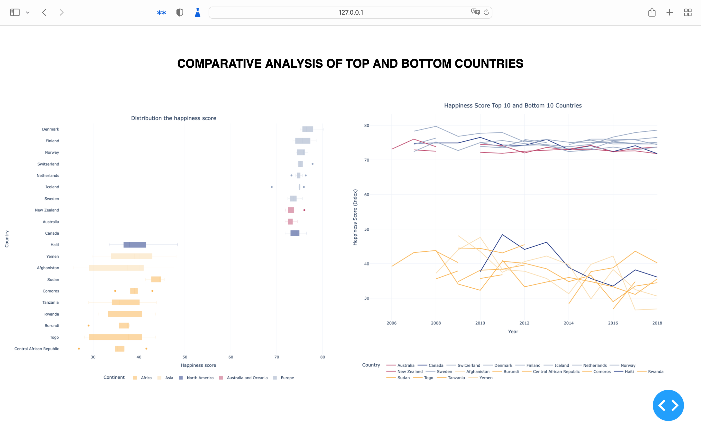
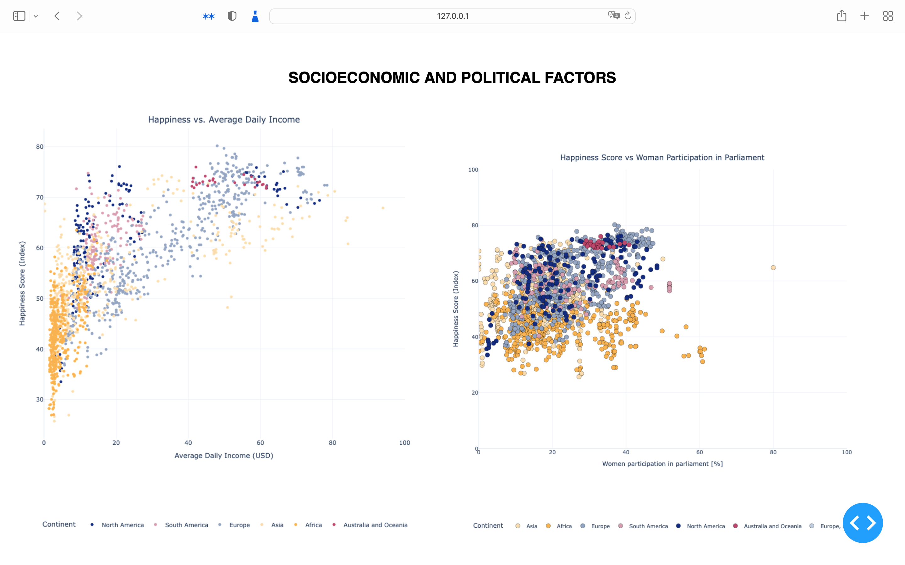
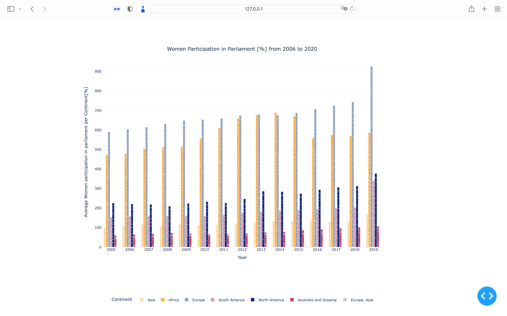
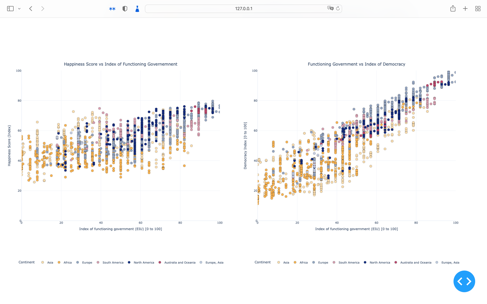
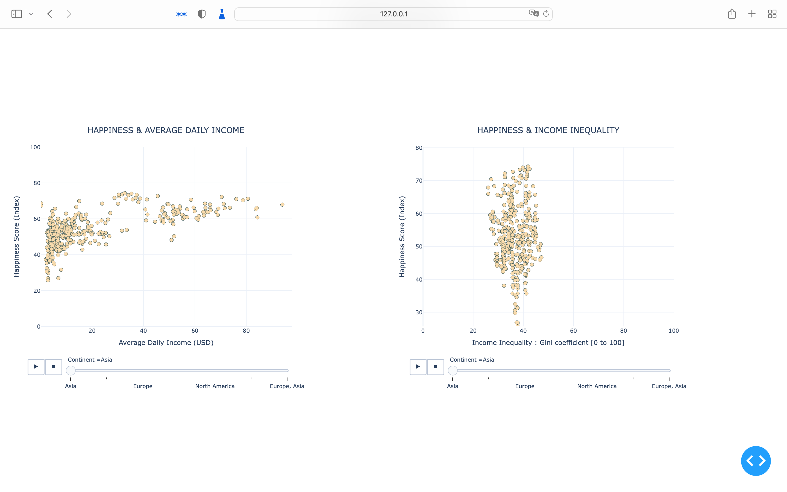
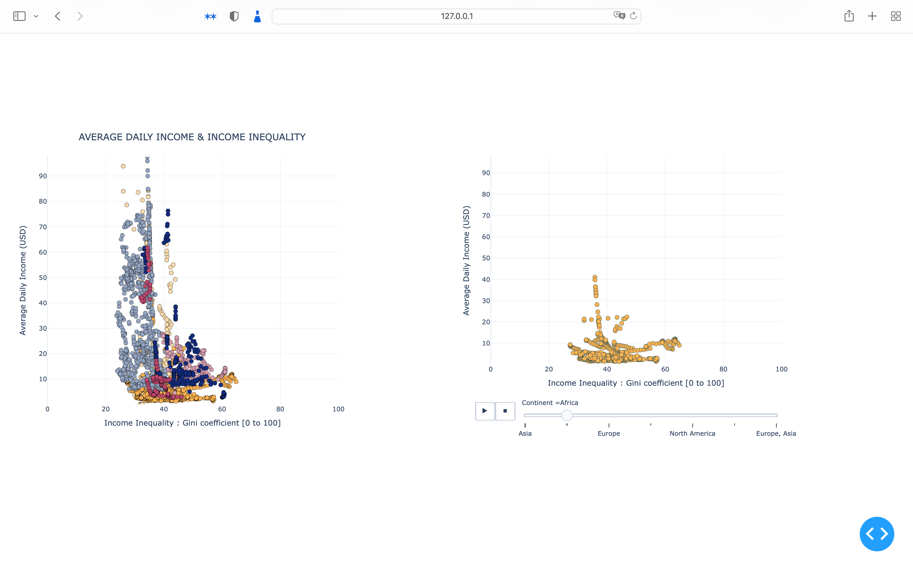
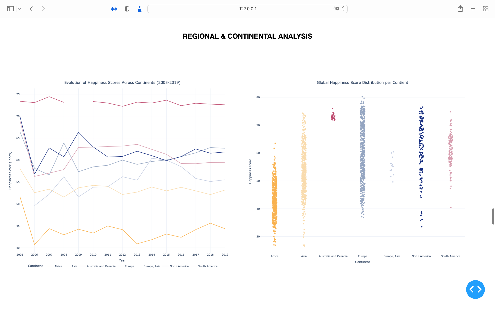

# Happiness Index Analysis
## How do different political/social and economic circumstances affect the happiness score of the population of countries. 

1. Global Overview of Happiness 
_providing a global perspective on happiness trends._

2. Comparative Analysis of Top and Bottom Countries 
_disparities in happiness by contrasting the highest and lowest scoring countries._

3. Socioeconomic and Political Factors 
_how various socioeconomic and political factors correlate with happiness._

4. Income Analysis 
_how income levels and inequality impact happiness._

5. Regional and Continental Analysis 
_regional differences and trends._

---

---

---

---

---

---

---

---

